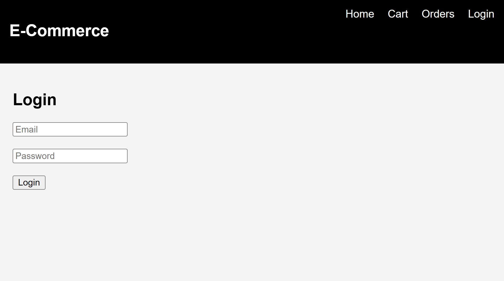
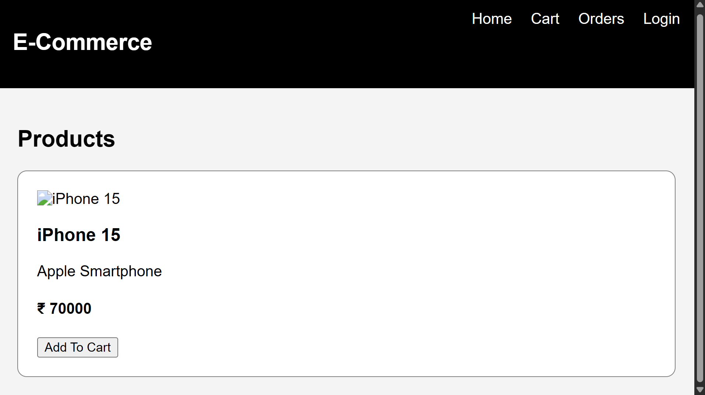
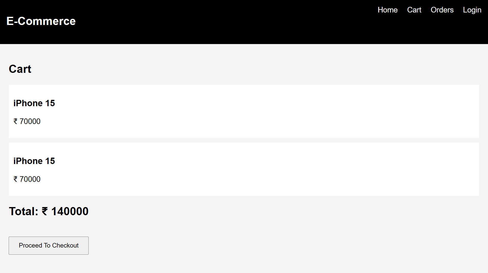
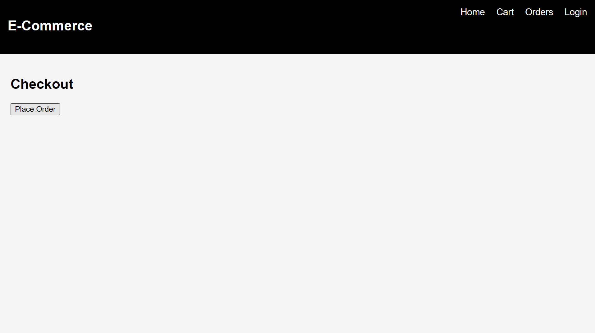
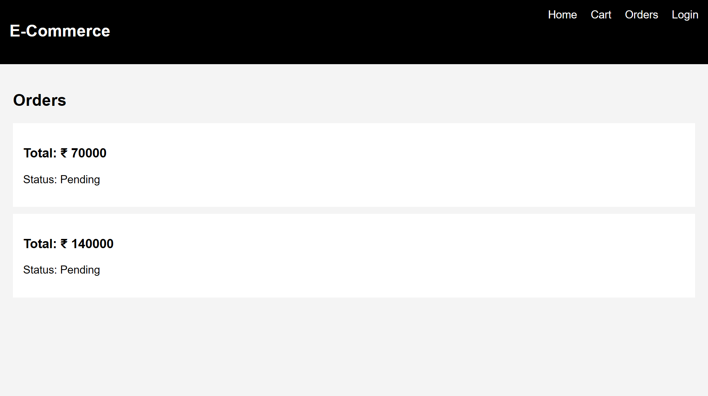

# E-Commerce Web Application

A full-stack E-Commerce web application built using the MERN Stack (MongoDB, Express.js, React.js, Node.js).

---

# Features

* User Registration & Login
* JWT Authentication
* Role-Based Access (Admin/User)
* Product Catalog
* Add To Cart
* Checkout Functionality
* Order Tracking
* MongoDB Database Integration
* REST API Backend

---

# Tech Stack

## Frontend

* React.js
* React Router DOM
* Axios

## Backend

* Node.js
* Express.js
* MongoDB
* Mongoose
* JWT Authentication
* bcryptjs

---

# Project Structure

```bash
E-Commerce-App/
│
├── backend/
│   ├── config/
│   ├── controllers/
│   ├── middleware/
│   ├── models/
│   ├── routes/
│   ├── server.js
│   └── .env
│
├── frontend/
│   ├── src/
│   │   ├── components/
│   │   ├── pages/
│   │   ├── App.js
│   │   └── index.js
│
└── README.md
```

---

# Installation

## Clone Repository

```bash
git clone https://github.com/YOUR_USERNAME/E-Commerce-App.git
```

---

# Backend Setup

```bash
cd backend
npm install
```

Create `.env` file:

```env
MONGO_URI=your_mongodb_connection
JWT_SECRET=mysecretkey
PORT=5000
```

Run backend:

```bash
npm run dev
```

---

# Frontend Setup

```bash
cd frontend
npm install
npm start
```

Frontend runs on:

```bash
http://localhost:3000
```

Backend runs on:

```bash
http://localhost:5000
```

---

# API Endpoints

## Authentication APIs

```bash
POST /api/auth/register
POST /api/auth/login
```

## Product APIs

```bash
GET /api/products
POST /api/products
```

## Order APIs

```bash
GET /api/orders
POST /api/orders
```

---

# Screenshots

## Login Page

Add screenshot here.

```md

```

---

## Home Page

Add screenshot here.

```md

```

---

## Cart Page

Add screenshot here.

```md

```

---
## Checkout Page

Add screenshot here.

```md

```

--- 

## Orders Page

Add screenshot here.

```md

```

---

# Future Improvements

* Payment Gateway Integration
* Product Search
* Wishlist
* Product Reviews & Ratings
* Admin Dashboard Improvements
* Responsive Mobile UI

---

# Learning Outcome

This project helped in understanding:

* Full Stack Development
* REST APIs
* Authentication & Authorization
* MongoDB Database Operations
* Frontend Routing
* State Management
* MERN Stack Architecture

---

# Author

Hari Prakash
